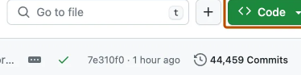
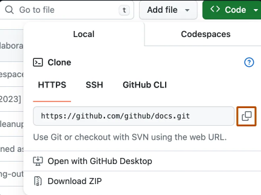
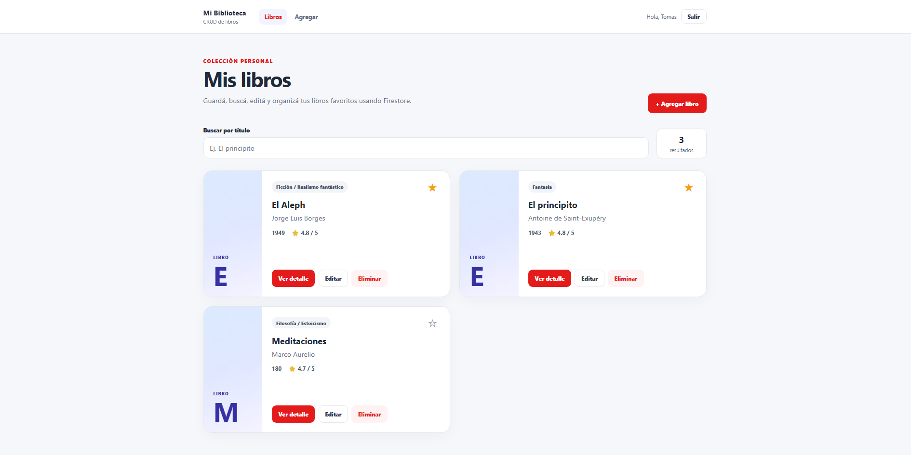
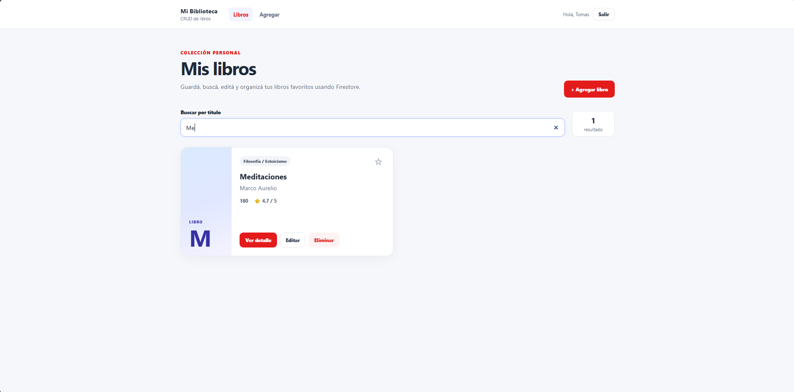
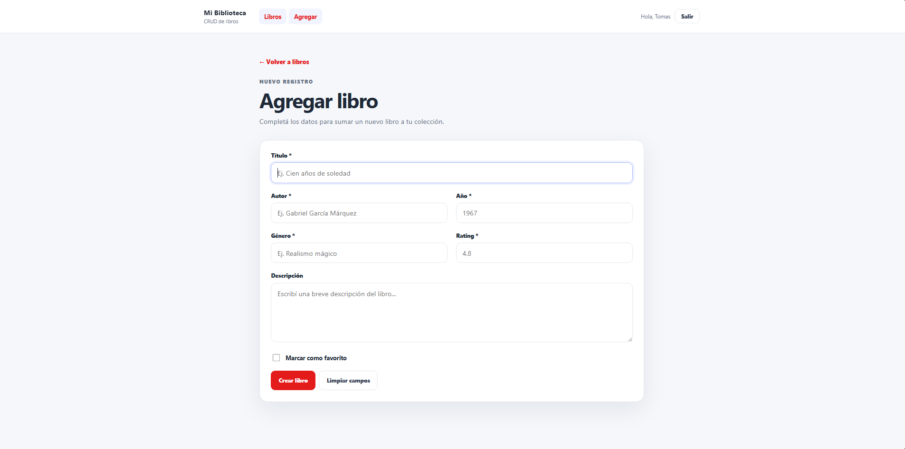
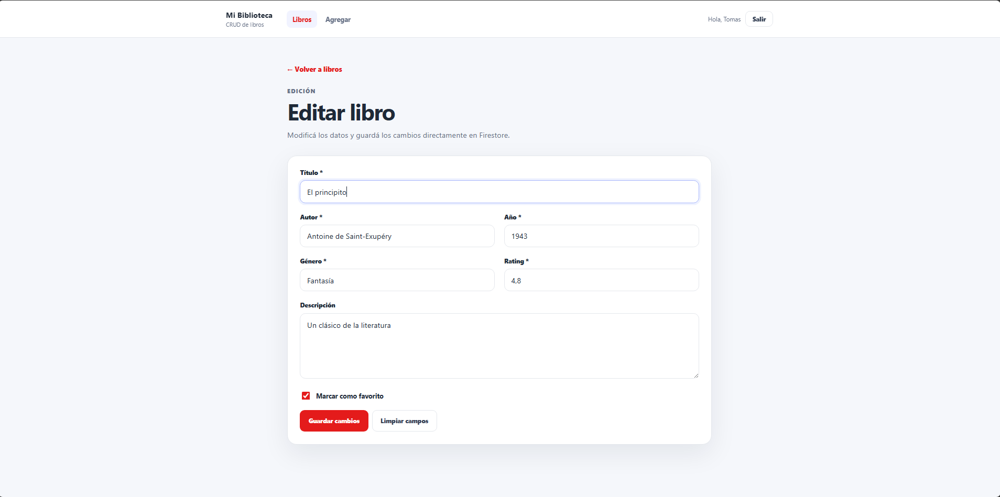
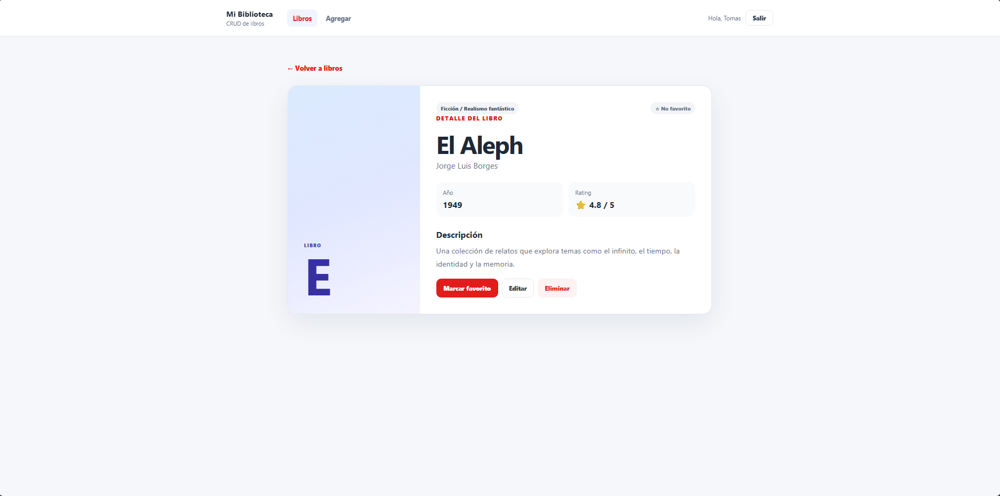

Hola, ¿cómo estas? Soy Tomás Bermúdez. Curso de Desarrollo en React JS. 181751

Aplicación web desarrollada con React, React Router y Firebase Firestore para llevar y organizar una colección personal de libros. La idea es poder agregar libros, ver los que ya están guardados y gestionar la colección de una manera simple y cómoda.

La temática elegida para el proyecto es libros.

Cada registro contiene:

- título
- autor
- año de publicación
- género
- rating
- estado de favorito
- descripción opcional
Instrucciones para clonar el repositorio y abrir la página

Rutas implementadas:

- /libros — listado principal.
- /login — sección de acceso.
- /libros/nuevo — formulario para crear.
- /libros/editar/:id — formulario para editar.
- /libros/:id — detalle mediante parámetro dinámico.
- página 404.

1. En GitHub, navegue hasta la página principal del repositorio.

2. Encima de la lista de archivos, haz clic en Code.

3. Copia la dirección URL del repositorio.

4. Cambia el directorio de trabajo actual a la ubicación en donde quieres clonar el directorio.

5. Escriba git clone y pegue la dirección URL que ha copiado antes.

"git clone https://github.com/ttomas4/Final-React---Tomas--Bermudez---181751.git"

6. Presione Enter para crear el clon local.

Ingresar a la carpeta del proyecto:

"cd Final-React---Tomas--Bermudez---181751"

Instalar las dependencias:

"npm install"

Ejecutar el proyecto:

"npm run dev"

Fotos de la página:

Pagina principal

Búsqueda

Agregar libro

Editar libro 

Favorito

<video controls src="2026-08-27 23-21-29.mkv" title=" "></video>

Ver detalles

Eliminar libro

<video controls src="2026-08-27 23-23-08.mkv" title="Title"></video>

